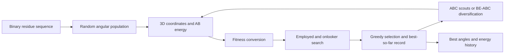

# Protein Structure Optimization via Metaheuristics

**Artificial bee colony search on an AB off-lattice energy landscape.** This MATLAB research archive contains an ABC demonstration and a balance-evolution ABC (BE-ABC) implementation for simplified protein-structure optimization.

The main reference is **Bai Li, Raymond Chiong, and Mu Lin**, “A balance-evolution artificial bee colony algorithm for protein structure optimization based on a three-dimensional AB off-lattice model,” *Computational Biology and Chemistry*, 54, 1–12, 2015. [Paper / DOI](https://doi.org/10.1016/j.compbiolchem.2014.11.004).

## Problem and representation

The AB model replaces an amino-acid sequence with two residue classes: hydrophobic A (`1`) and hydrophilic B (`0`). A candidate conformation is represented by angular variables and evaluated using a bending contribution plus nonbonded pair interactions. Lower energy is better.

For a chain of `n` residues, the 3D scripts optimize `D = 2*n - 5` angles in **degrees**, each bounded by −180° and 180°. The pair potential uses coefficients `1` for A–A, `0.5` for B–B, and `−0.5` for mixed pairs. Consecutive residues are excluded from the nonbonded interaction sum.

This is a coarse-grained numerical optimization model. Its objective values describe the AB model; the code does not infer an experimentally validated all-atom protein structure.



## Run the short demonstration

Requirements: **MATLAB** and the files in this repository. The numerical objective and search use base MATLAB operations; no AMPL, CasADi, Optimization Toolbox, GPU, or external dataset is needed. `asd.p` is a protected MATLAB visualization helper used by the short demonstration.

```matlab
cd('C:/path/to/Protein-Structure-Optimization-via-Metaheuristics');
rng(1);                 % Optional repeatable random initialization
runABC;
```

`runABC.m` uses the included 55-residue D55 sequence, 20 food sources, **10 iterations**, and one independent run. It prints the best-so-far energy and invokes the visualization. It saves `abc_d55.mat` with `abc`, `GlobalMin`, `GlobalParams`, and `sequence`.

The short iteration budget is a demonstration setting; it is not intended to reproduce the paper's best reported energies. The best conformation, `GlobalParams`, contains 105 angular variables for D55.

## Run BE-ABC

```matlab
rng(1);
run_BEABC;
```

The default is a longer experiment: **5 independent runs × 5,000 iterations**, with `NP = 40`, `FoodNumber = NP/2 = 20`, and `alpha = 0.9`. The script records best-so-far energy in `be`, writes `be_d55.mat`, and plots the mean convergence history. The current run's best parameters remain in `GlobalParams`; only the last run's parameters are retained by that variable.

BE-ABC adapts the number/intensity of search perturbations using per-source trial information and applies population diversification when the mean trial statistic exceeds its threshold. For a quick installation check, temporarily reduce `maxCycle` and `runtime` at the top of `run_BEABC.m`; retain the full budget for comparative experiments.

Both scripts initialize their own global `sequence` and clear workspace variables. To study another chain, edit the binary sequence **inside the selected entry script**; setting it in the workspace beforehand will be overwritten. The decision dimension is then recomputed automatically. Use multiple seeds and independent runs when comparing stochastic methods.

## Files and functions

| File | Role |
| --- | --- |
| `runABC.m` | Short conventional ABC demonstration: initialization, employed/onlooker/scout phases, best-so-far tracking, plotting, and saving. |
| `run_BEABC.m` | BE-ABC experiment with adaptive search and population diversification. |
| `libai.m` | **3D** conformation construction and AB energy objective used by both entry scripts. Reads global `sequence`. |
| `calculateFitness.m` | Convert energy to positive fitness: `1/(E+1)` for `E >= 0`, and `1+abs(E)` otherwise. Larger fitness is preferred. |
| `fitness.m` | Separate **2D** AB objective retained from related work. It is not the objective called by the two 3D entry scripts. |
| `asd.p` | Protected visualization helper invoked by `runABC`. |
| `freezeColors.m`, `unfreezeColors.m`, `cbfreeze.m` | Legacy graphics utilities for freezing/restoring colormaps and colorbars; preserve their embedded author notices. |
| `abc_d55.mat` | Archived/sample result file; a fresh `runABC` overwrites it with the current run. |
| `qwe.m` | Historical workspace/figure clearing script; not part of the optimization pipeline. |
| `readme.txt` | Historical short note; this README is the current usage guide. |

The local variable name `objval` denotes energy, while `Fitness` denotes its selection transform. Do not compare fitness values directly with the energies in the papers. The angle convention uses `sind`/`cosd`; replacing these with radian functions changes the model.

## Papers and citation

Please cite the main BE-ABC paper when using its algorithm:

```bibtex
@article{Li2015BEABC,
  author = {Bai Li and Raymond Chiong and Mu Lin},
  title = {A balance-evolution artificial bee colony algorithm for protein
           structure optimization based on a three-dimensional AB off-lattice model},
  journal = {Computational Biology and Chemistry},
  volume = {54}, pages = {1--12}, year = {2015},
  doi = {10.1016/j.compbiolchem.2014.11.004}
}
```

The repository also contains two related papers:

| Included PDF | Published work |
| --- | --- |
| `CABC_2014.pdf` | Main BE-ABC paper above. The filename reflects its 2014 online publication; the journal volume is dated 2015. |
| `JOMM.pdf` | B. Li, M. Lin, Q. Liu, Y. Li, and C. Zhou, “Protein folding optimization based on 3D off-lattice model via an improved artificial bee colony algorithm,” *Journal of Molecular Modeling*, 21, article 261, 2015. [DOI](https://doi.org/10.1007/s00894-015-2806-y). |
| `Protein secondary structure optimization using an improved artificial bee colony algorithm based on AB off-lattice model1.pdf` | B. Li, Y. Li, and L. Gong, “Protein secondary structure optimization using an improved artificial bee colony algorithm based on AB off-lattice model,” *Engineering Applications of Artificial Intelligence*, 27, 70–79, 2014. [DOI](https://doi.org/10.1016/j.engappai.2013.06.010). |

Cite the related paper as well when using its specific model or method. The two 3D entry scripts are not a single command that reproduces every experiment in all three publications.

## License

See [LICENSE](LICENSE) for GPL-3.0 terms. Included papers and third-party graphics utilities retain their own copyright and notices.
